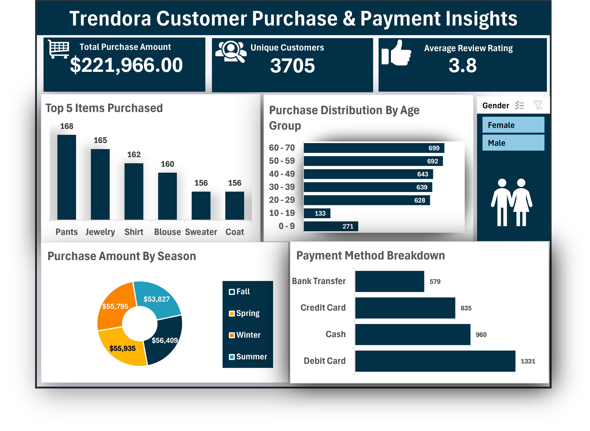
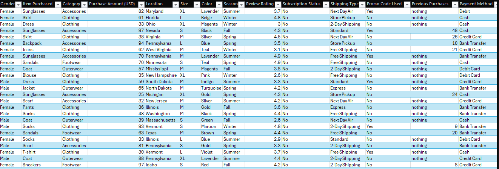

# Trendora-Sales-Analytics-Dashboard
This project delivers a structured sales analytics dashboard built in Microsoft Excel for Trendora, a multi-channel fashion retailer operating across online and in-store channels.

## Dashboard

The objective was to transform raw transactional purchase data into a decision-support dashboard that enables leadership to quickly evaluate revenue performance, customer behavior, seasonal trends and payment preferences.

The final output is a single-page, executive-ready dashboard powered by PivotTables, structured data modeling, and slicer-driven interactivity.

This solution demonstrates how Excel can be leveraged as a lightweight business intelligence tool for operational and strategic analysis.

## Business Objective
Trendora required visibility into:

- Overall revenue performance

- Customer scale and engagement

- Product demand concentration

- Demographic purchasing behavior

- Seasonal revenue distribution

- Payment channel usage

The dashboard centralizes these metrics into a clean, interactive analytical interface.

## Data Cleaning & Preparation
The raw transactional dataset was structured to ensure analytical reliability and scalability.

### Data Preparation Included:

- Validation of customer identifiers

- Standardization of categorical variables (Season, Payment Method, Gender)

- Currency normalization and numeric formatting

- Removal of incomplete and inconsistent entries

- Age grouping for demographic segmentation

- Conversion to structured Excel Table format for dynamic referencing

Where necessary, the Excel Data Model was leveraged to enable accurate distinct counts and aggregation logic.

## Executive KPIs
Three primary performance indicators anchor the dashboard:
| Metric                      | Value           |
| --------------------------- | --------------- |
| **Total Revenue**           | **$221,966.00** |
| **Total Unique Customers**  | **3,705**       |
| **Average Customer Rating** | **3.8 / 5**     |

### Interpretation
- Revenue performance indicates solid transactional throughput.

- A customer base of 3,705 unique buyers reflects broad market reach.

- An average rating of 3.8 suggests generally positive sentiment with room for service optimization.

These KPIs dynamically update based on applied slicer filters.

## Analytical Insights
- Demand is distributed across multiple core apparel categories rather than being dependent on a single SKU. This reduces product concentration risk and indicates diversified purchasing patterns.

- Contrary to common fashion retail assumptions, older demographics represent the strongest purchasing segment in this dataset. Marketing allocation strategies may need demographic recalibration.

- Revenue remains stable across all seasons, with no extreme peaks or troughs. This indicates consistent year-round demand and reduces seasonal volatility risk.

- Debit card usage dominates transaction behavior, signaling strong preference for immediate digital payment methods. Bank transfers represent the least utilized channel.

This insight can inform payment optimization strategies and POS integration decisions.

## Dashboard Architecture
The dashboard was designed using:

- Structured Excel Tables

- PivotTables connected to a centralized data source

- PivotCharts for visual abstraction

- Data Model for distinct customer calculation

- Slicers for dynamic gender-based filtering

- Linked KPI cards for real-time metric updates

All visual components are synchronized, allowing interactive filtering without breaking metric consistency.

### Data Preview

## Dataset
[Interactive Excel Dashboard/Dataset](trendora_data_analysis_Innocent-Daniel-1.xlsx)

## Technical Competencies Demonstrated

- Data structuring and transformation in Excel

- Advanced PivotTable configuration

- Distinct count implementation via Data Model

- Age bin grouping and categorical segmentation

- Top-N filtering techniques

- Interactive slicer integration

- Executive dashboard layout optimization

- Analytical storytelling through visualization

## Conclusion
This project demonstrates the ability to architect a structured analytical solution from raw retail transaction data to an interactive executive dashboard.

It reflects applied data analysis capability, business interpretation depth, and dashboard engineering discipline using Excel as a BI tool.
